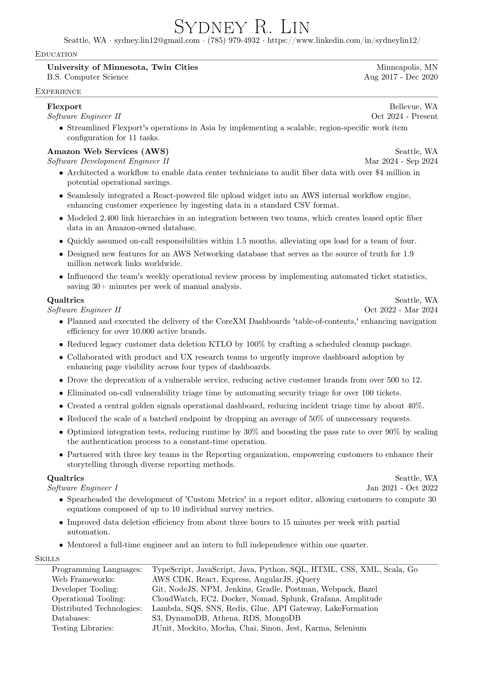

# Resume


## Editing - Manually
1. https://latexresu.me
2. Import the JSON.

## Editing - Script
1. Create a Python virtual environment.

```
python3 -m venv ./
source ./bin/activate
```

2. Install dependencies.

```
brew install poppler && pip install requests && pip install pdf2image
```

3. Run the script.

```
python get-resume.py
```
