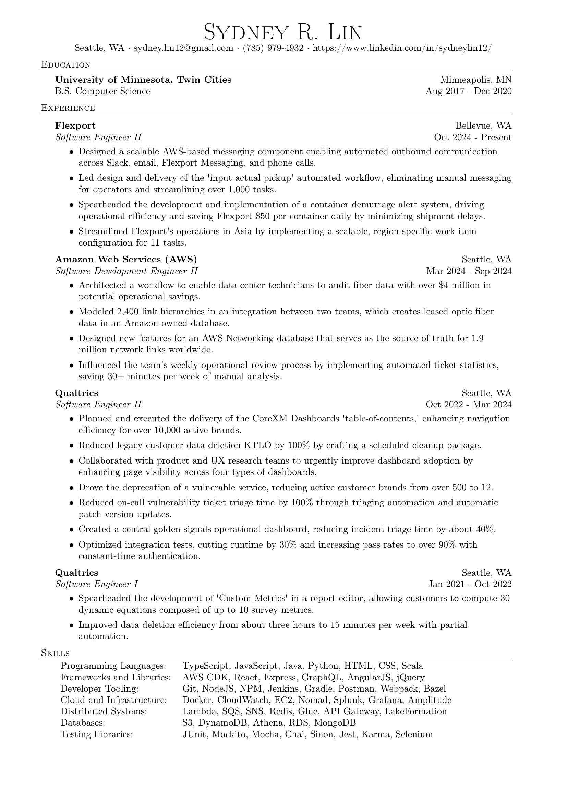

# Resume


## Editing - Manually
1. https://latexresu.me
2. Import the JSON.

## Editing - Script
1. Create a Python virtual environment.

2. Install dependencies.

    ```
    brew install poppler
    pip install requests
    pip install pdf2json
    ```

3. Run the script.

    ```
    python get-resume.py
    ```
